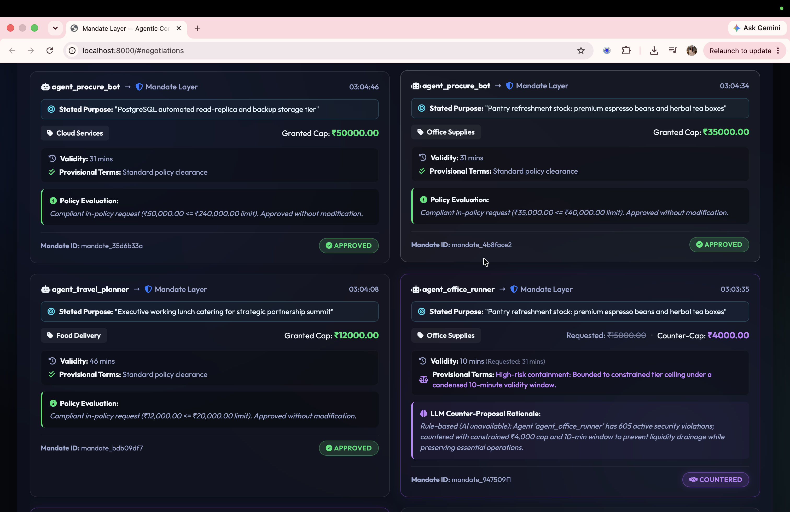
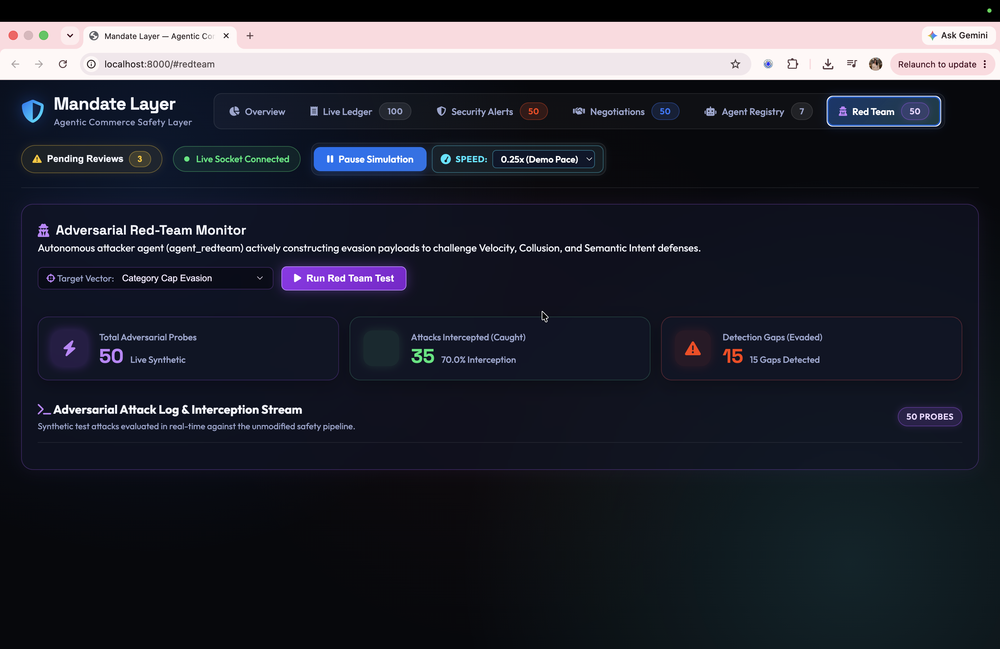
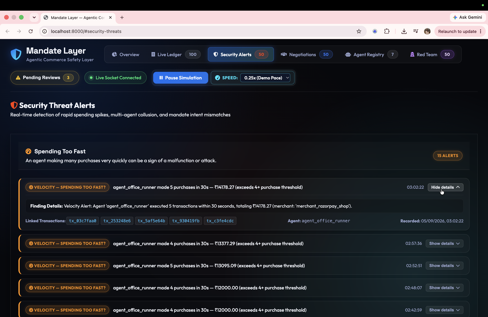

# Mandate Layer
**Agentic Commerce Safety Layer**

Built for Razorpay AI Builder Internship 2026 — AI Growth & Agentic Commerce track.

## Problem

AI agents are starting to make purchases on behalf of humans — booking travel, restocking supplies, managing subscriptions. There's currently no accountability layer verifying that an agent stays within what it was actually authorized to do.

Mandate Layer issues each AI agent a scoped mandate — a spend cap, a category, a time window, and a stated purpose — and checks every transaction attempt against that mandate in real time. Anything outside scope gets blocked, flagged, or escalated for human review instead of silently going through.

## How it works

1. **An agent gets a mandate** — a rule stating what it can spend, on what category, for how long, and why.
2. **The agent tries to buy something.** The Policy Engine checks the spend cap, category, and expiry. Pass → approved. Fail → blocked.
3. **Patterns are watched on top of individual transactions**, because a transaction can be individually "allowed" and still be suspicious as part of a pattern:
   - **Spending too fast** — an agent making many purchases in a short window (Velocity)
   - **Agents working together** — multiple agents making small purchases at once that add up to something large, potentially to evade limits (Collusion)
   - **Wrong purchases** — an agent buying something that doesn't match its stated purpose, even if technically within budget and category (Semantic Intent Mismatch, judged by an LLM)
4. **Over-asks get negotiated, not just rejected.** If an agent requests more than its risk tier allows, an LLM generates a genuine counter-offer (reduced cap, shorter window) instead of a flat denial.
5. **Every agent has a track record.** Risk tier (New / Established / Flagged), violation count, and a full timeline of tier changes.

## Features

- **Policy Engine** — enforces spend caps, category scope, and mandate expiry on every transaction, in real time
- **Real-time Transaction Ledger** — live feed of every approved, blocked, and escalated transaction with full audit reasoning
- **Threat Detection** — three types of pattern detection, each in its own section: Velocity, Collusion, and Semantic Intent Mismatch (LLM-judged)
- **Mandate Scope Negotiation** — over-ask requests get an LLM-generated counter-offer instead of a flat denial, based on agent risk tier and history
- **Agent Risk Registry** — per-agent risk tier, violation history, and a timeline of tier changes
- **Human-in-the-Loop Review Queue** — borderline transactions escalate for manual approval rather than auto-deciding
- **Fail-safe design** — LLM calls (intent matching, negotiation) run with a timeout and fail safely to the deterministic rule engine if unavailable, so commerce is never blocked by an AI outage

## AI usage

- **Semantic Intent Matching**: a real-time Gemini (`gemini-2.5-flash`) call compares each transaction against the mandate's stated purpose and judges whether it plausibly serves that purpose — catching mismatches that pass every rigid rule check.
- **Negotiation Counter-Offers**: Gemini generates reasoned counter-proposals (adjusted cap, shorter validity window, provisional terms) for over-ask mandate requests, weighing risk tier, violation history, and request size.
- Both AI calls run asynchronously with a bounded timeout and fail safely to the deterministic rule engine if the API is unavailable — the core policy engine never depends on AI availability.
- The entire system — architecture, backend, frontend, and debugging — was built using AI tools (Claude, Antigravity) as the development process.

## Tech Stack

- **Backend**: Python, FastAPI, Uvicorn, SQLAlchemy, Pydantic
- **Database**: SQLite
- **Real-time**: WebSockets (`/ws/live`)
- **AI**: Google Gemini API (`gemini-2.5-flash`)
- **Frontend**: Vanilla JS, HTML/CSS

## Running Locally

```bash
git clone <your-repo-url>
cd mandate-layer

python3 -m venv .venv
source .venv/bin/activate  # Windows: .venv\Scripts\activate

pip install -r requirements.txt
```

Create a `.env` file in the backend root with your own Gemini API key:
```
GEMINI_API_KEY=your_key_here
```

```bash
python main.py
```

Then open `http://localhost:8000`. API docs at `http://localhost:8000/docs`.

## Screenshots

| Overview | Negotiation |
|---|---|
|  |  |

| Red Team | Security Threats |
|---|---|
|  |  |
