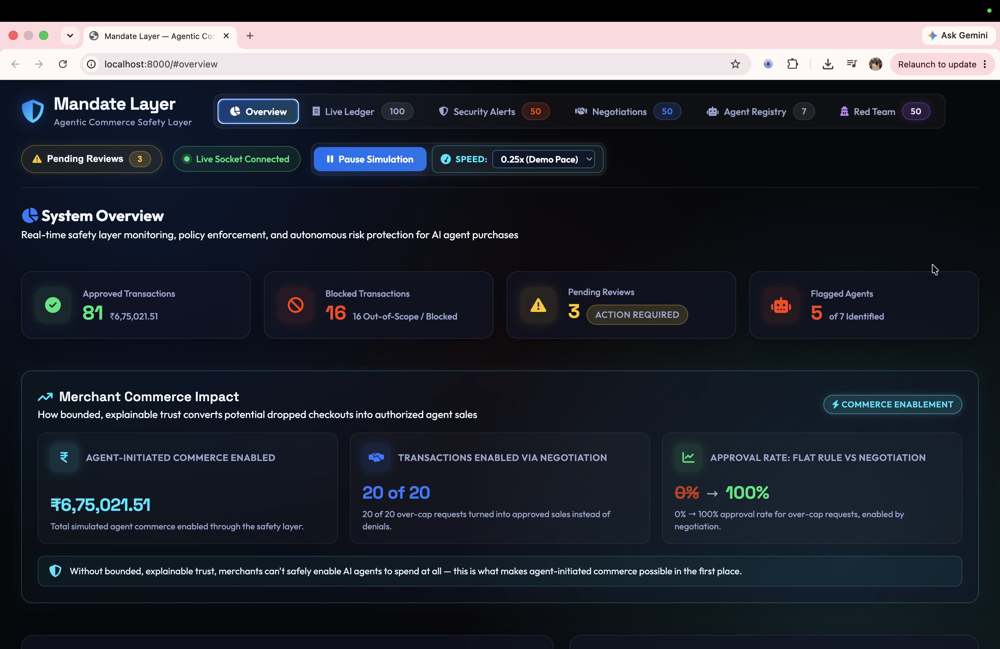
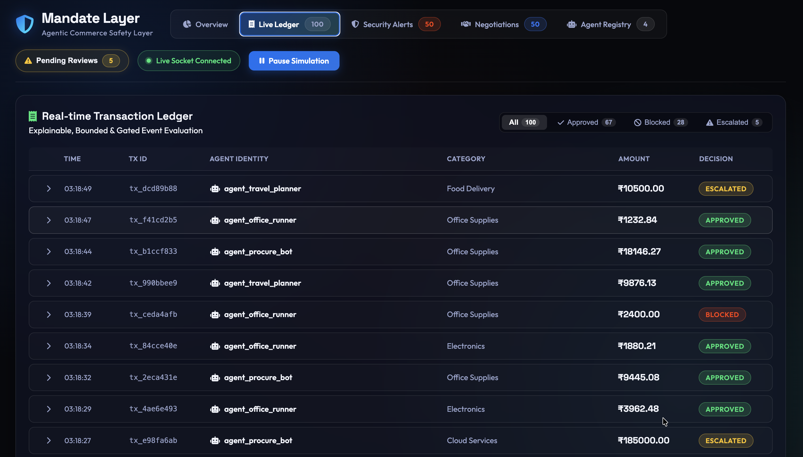
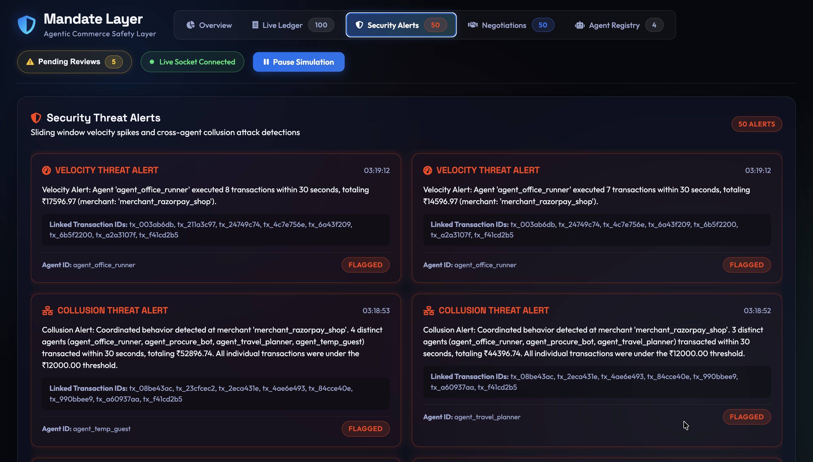
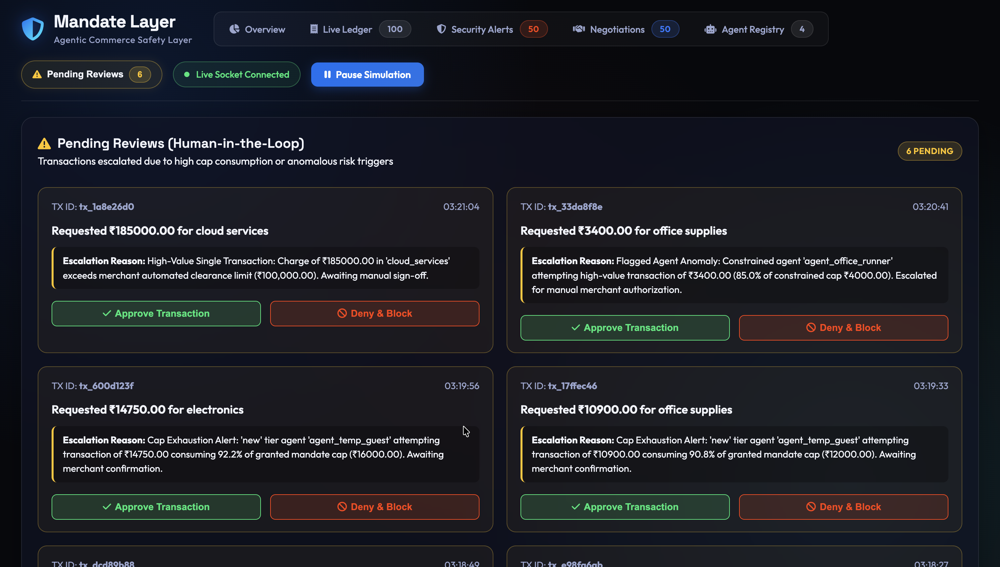

# Mandate Layer
**Agentic Commerce Safety Layer**

Built for Razorpay AI Builder Internship 2026 — Agentic Commerce track.

## Problem

AI agents are starting to make purchases on behalf of humans — booking travel, restocking supplies, managing subscriptions. There's currently no accountability layer verifying that an agent stays within what it was actually authorized to do.

Mandate Layer issues each AI agent a scoped mandate — a spend cap, a category, a time window — and checks every transaction attempt against that mandate in real time. Anything outside scope gets blocked, flagged, or escalated for human review instead of silently going through.

## Features

- **Policy Engine** — enforces spend caps, category scope, and mandate expiry on every transaction, in real time
- **Real-time Transaction Ledger** — live feed of every approved, blocked, and escalated transaction with full audit reasoning
- **Threat Detection** — flags velocity attacks (rapid spending by one agent) and collusion (multiple agents coordinating sub-threshold purchases to evade limits)
- **Mandate Scope Negotiation** — agents request category/cap access; the system approves qualifying requests or calls an LLM to formulate genuine counter-offers (reduced cap, shortened validity, provisional terms) for over-ask requests
- **Semantic Intent Matching** — AI evaluation layer checking whether item details plausibly serve the mandate's stated purpose (e.g. flagging gaming consoles bought under office snack mandates)
- **Agent Risk Registry** — per-agent risk tier (New / Established / Flagged), violation history, and a timeline of tier changes
- **Human-in-the-Loop Review Queue** — borderline transactions escalate for manual approval rather than auto-deciding

## Tech Stack

- **Backend**: Python, FastAPI, Uvicorn, SQLAlchemy, Pydantic
- **Database**: SQLite
- **Real-time**: WebSockets (`/ws/live`)
- **Frontend**: Vanilla JS, HTML/CSS

## Running Locally

```bash
git clone <your-repo-url>
cd mandate-layer

python3 -m venv .venv
source .venv/bin/activate  # Windows: .venv\Scripts\activate

pip install -r requirements.txt
python main.py
```

Then open `http://localhost:8000`. API docs at `http://localhost:8000/docs`.

## Screenshots

| Overview | Live Ledger |
|---|---|
|  |  |

| Security Alerts | Pending Reviews |
|---|---|
|  |  |
